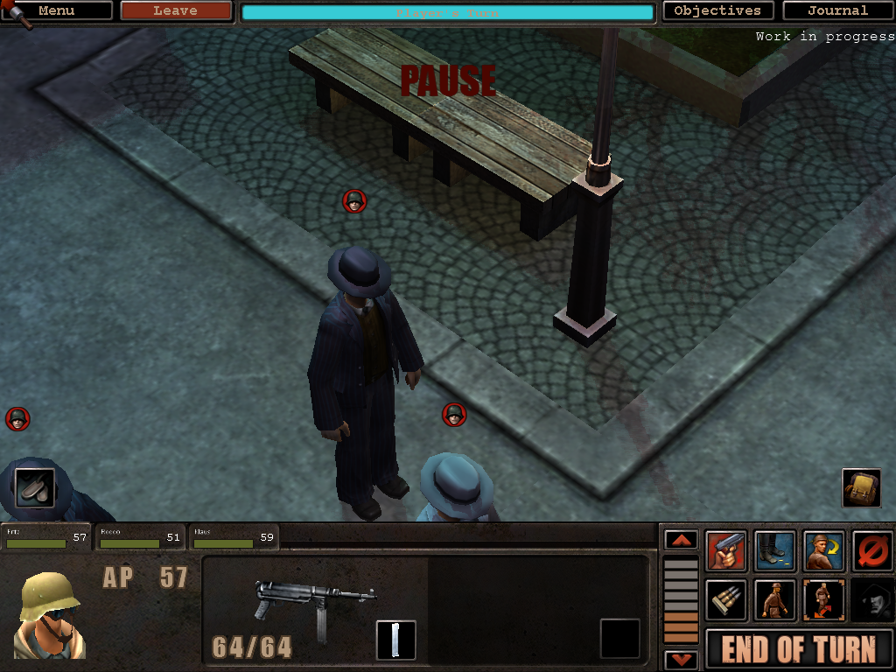

# Silent Storm 2

A non-commercial fan sequel to Nival's *Silent Storm* (2003): a turn-based
tactical RPG about a WWII special operations squad, built on the original
engine and its destructible buildings.

**Status: early development.** There is no playable campaign yet. What exists
is the pipeline that turns text sources into missions the engine runs, and a
first mission built with it ("Cold Welcome": free a resistance contact held at
a snowbound farm). A proposal for the first theater is in
[design/gdd/vertical-slice-norway.md](design/gdd/vertical-slice-norway.md).



## How it works

SS2 does not ship the game. It ships *sources* (mission descriptions and Lua
scripts) and *tools* that compile them onto a copy of your own Silent Storm
data, to run on a modern port of the original engine.

```
your Silent Storm install  +  this repo (game/, tools/)  +  engine port build
                         └──────────► build/run ◄──────────┘
```

- `game/`: SS2 content as text. A mission is a `mission.toml` and a
  `script.lua`.
- `tools/`: Python tools that stage your retail data, compile the content into
  the game database, launch the result and capture screenshots and logs.
- `design/`: the game concept and design documents.
- `docs/`: how to author content, architecture decisions and engine notes.

Nothing from the retail game is stored in this repository, and the build never
writes to your install.

## Requirements

- An owned copy of Silent Storm (Steam or GOG).
- A build of the ported engine (Nival's 2003 source, released in 2026, built
  with a modern compiler). The port lives in a separate repository.
- Windows, Python 3.11 or newer.

## Quick start

```
copy ss2.local.example.toml ss2.local.toml     # then edit the two paths
python tools/build.py
python tools/run.py map 50010 118 116 42 120 --front    # mission 1 with the SS2 squad
python tools/test_missions.py                           # scripted playthroughs
```

Details, the mission file format and the script dialect are in
[docs/content-pipeline.md](docs/content-pipeline.md).

## Documents

- [Game concept](design/gdd/game-concept.md)
- [Authoring content](docs/content-pipeline.md)
- [ADR-0001: content layer on the ported engine](docs/architecture/adr-0001-content-layer-on-ported-engine.md)

## Licence and credits

- *Silent Storm*, its engine source and its data belong to Nival. Nival's
  source release is under a non-commercial licence; SS2 is a free fan project
  and requires an owned copy of the game.
- This repository started from the
  [Claude Code Game Studios](https://github.com/Donchitos/Claude-Code-Game-Studios)
  template by Donchitos (MIT, see [LICENSE](LICENSE)). Its agent, skill and hook
  definitions are under `.claude/`; its original README is kept as
  [docs/studio-template.md](docs/studio-template.md).
